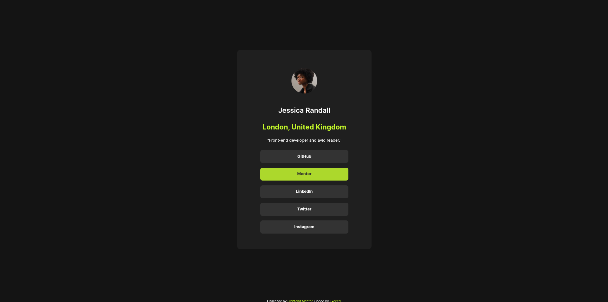

# Frontend Mentor - Social links profile solution

This is a solution to the [Social links profile challenge on Frontend Mentor](https://www.frontendmentor.io/challenges/social-links-profile-UG32l9m6dQ). Frontend Mentor challenges help you improve your coding skills by building realistic projects.

## Table of contents

- [Overview](#overview)
  - [The challenge](#the-challenge)
  - [Screenshot](#screenshot)
  - [Links](#links)
  - [My process](#my-process)
  - [Built with](#built-with)
  - [Useful resources](#useful-resources)

## Overview

This is a free exercise from Front-endmentor.io which utilizes the fundamentals of CSS and semantic HTML.

### The challenge

Users should be able to:

- See hover and focus states for all interactive elements on the page

### Screenshot

### Links

- Solution URL: [https://github.com/Exc1D/social-links.git]
- Live Site URL: [https://exc1d.github.io/social-links/]

## My process

I downloaded the pre-formatted starter code and other necessary files from Front-end mentor which is free by the way. Then I sent the .fig file to pixso.net so that I can analyze the properties

### Built with

- Semantic HTML5 markup
- CSS custom properties
- Flexbox

### Useful resources

- pixso.net - this app has a free dev mode that can be used to analyze specific CSS properties that were otherwise a paid feature in figma.
